# 🚀 Project POLARIS
## NASA L'SPACE Mission Concept Academy
### Lunar Permanently Shadowed Region (PSR) Rover Mission Concept

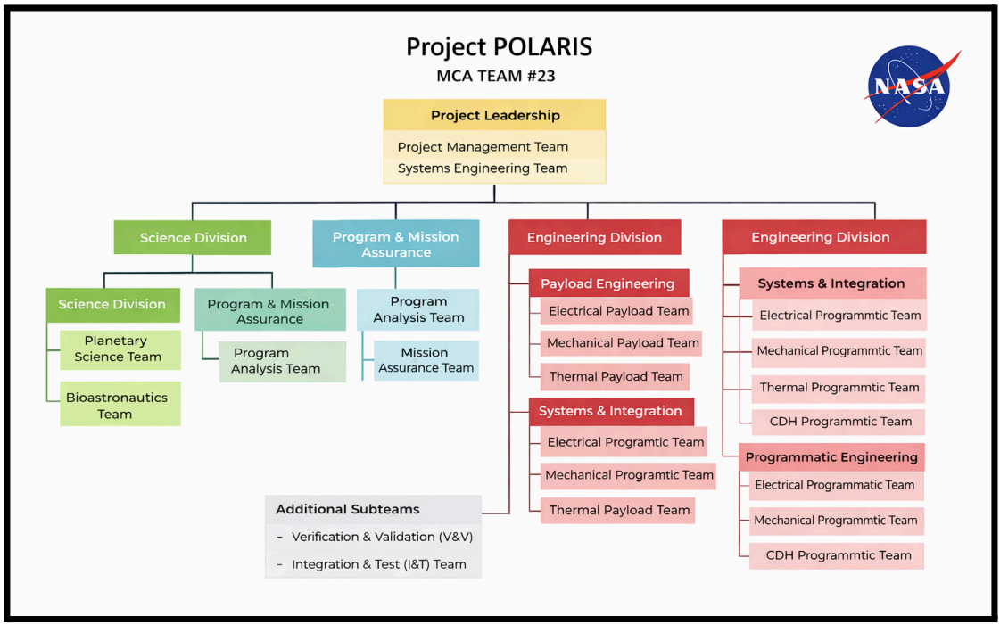
---

## Overview

Project **POLARIS** (Polar Operations for Lunar Assessment of Resources, Ice, and Subsurface) is a conceptual robotic lunar exploration mission developed as part of NASA's **L'SPACE Mission Concept Academy**.

The mission investigated the abundance, distribution, and preservation of water-related volatiles (H₂O and OH) within permanently shadowed regions (PSRs) near the lunar south pole. The rover concept combined spectroscopy, thermal sensing, illumination measurements, and subsurface sampling to characterize volatile deposits and support future Artemis exploration.

The mission was developed following NASA's systems engineering lifecycle and progressed through four formal design reviews:

- Mission Concept Review (MCR)
- Systems Requirements Review (SRR)
- Mission Definition Review (MDR)
- Preliminary Design Review (PDR)
---
## Table of Contents

- [Project Highlights](#project-highlights)
- [My Contributions](#my-contributions)
- [Mission Objectives](#mission-objectives)
- [Mission Location](#mission-location)
- [Concept of Operations](#concept-of-operations)
- [Command & Data Handling Architecture](#command--data-handling-architecture)
- [Command & Data Handling Engineering](#command--data-handling-engineering)
- [NASA Systems Engineering Reviews](#nasa-systems-engineering-reviews)
- [Mission Schedule](#mission-schedule)
- [Technical Skills Demonstrated](#technical-skills-demonstrated)
- [Certificate](#certificate)
- 
# Project Highlights

- NASA L'SPACE Mission Concept Academy graduate
- Co-authored four NASA-style systems engineering deliverables (MCR, SRR, MDR, and PDR) as part of a multidisciplinary engineering team
- Designed the rover's Command & Data Handling (CDH) subsystem
- Authored CDH subsystem requirements and verification plans
- Performed weighted trade studies for onboard computer, communications, data storage, and interfaces
- Developed CDH mass and power budgets (0.727 kg, ~13 W peak)
- Developed mission schedule and cost basis of estimate as Deputy Program Manager of Resources

# My Contributions

## Command & Data Handling (CDH) Engineer

Designed the rover's Command & Data Handling subsystem responsible for command execution, telemetry management, onboard data storage, subsystem communications, and fault management.

Key contributions included:

- Designed the CDH software architecture
- Defined subsystem requirements
- Performed hardware trade studies
- Selected onboard computer and storage architecture
- Developed communication and data interface architecture
- Designed Fault Detection, Isolation & Recovery (FDIR) strategy
- Created subsystem mass and power budgets
- Developed verification plans
- Supported subsystem integration

---

## Deputy Program Manager of Resources (DPMR)

Contributed to the technical and programmatic development of Project POLARIS throughout the NASA systems engineering lifecycle.

Key contributions included:

- Co-authored the Mission Concept Review (MCR), Systems Requirements Review (SRR), Mission Definition Review (MDR), and Preliminary Design Review (PDR)
- Developed the Schedule Basis of Estimate (BoE)
- Developed the Cost Basis of Estimate (BoE)
- Created the integrated mission schedule
- Supported procurement and resource planning
- Performed mission cost estimation
- Coordinated design review preparation with multidisciplinary engineering teams
---

# Mission Objectives

The mission was designed to:

- Detect water ice (H₂O) and hydroxyl (OH) deposits
- Characterize volatile abundance
- Study volatile preservation within permanently shadowed regions
- Collect subsurface regolith samples
- Measure temperature and illumination
- Support future Artemis missions
- Improve understanding of lunar volatile evolution

---

# Mission Location

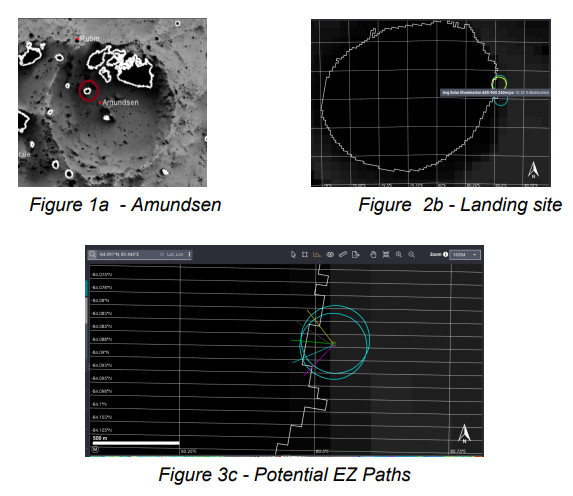

Project POLARIS targeted the **Faustini-Amundsen crater region** near the Moon's south pole.

This location was selected because permanently shadowed regions (PSRs) are believed to preserve water ice and other volatile compounds due to extremely low temperatures. The rover was designed to traverse from illuminated terrain into the PSR while collecting scientific measurements at multiple locations.

---

# Concept of Operations

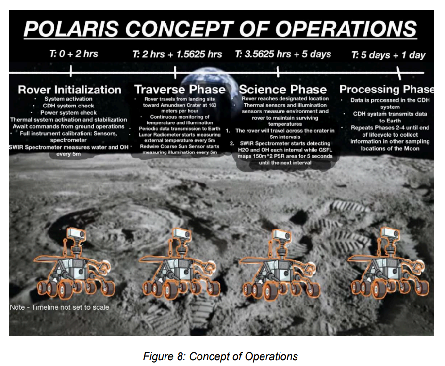

The Concept of Operations (ConOps) divided the mission into four operational phases:

## 1. Rover Initialization

- System activation
- Thermal system startup
- Power system checks
- Sensor calibration
- Instrument initialization

## 2. Traverse Phase

- Autonomous rover navigation
- Continuous thermal monitoring
- Illumination measurements
- Periodic telemetry transmission
- Scientific instrument preparation

## 3. Science Operations

- Spectrometer measurements
- Thermal measurements
- Illumination measurements
- 3D mapping
- Regolith sampling
- Volatile characterization

## 4. Data Processing

- Telemetry processing
- Scientific data storage
- Error correction
- Direct-to-Earth transmission
- Preparation for next science cycle

---

# Command & Data Handling Architecture

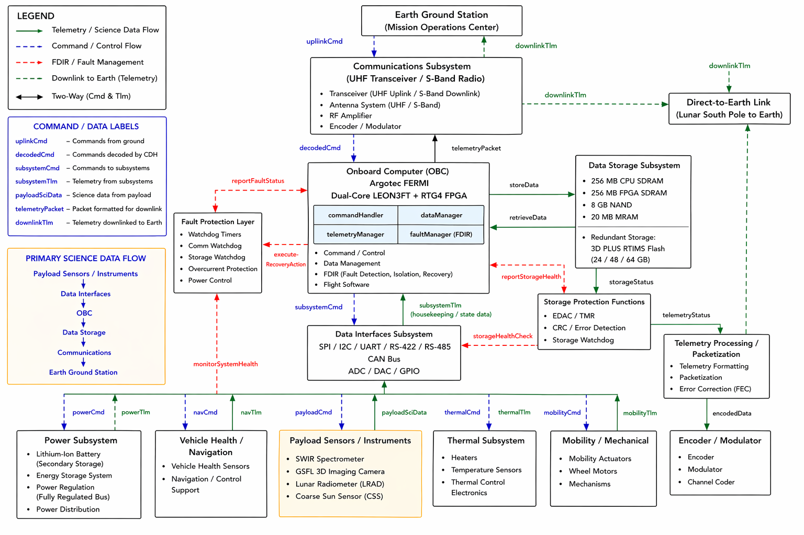

The Command & Data Handling (CDH) subsystem served as the central computing architecture of the rover.

The architecture coordinated:

- Command execution
- Scientific data management
- Telemetry processing
- Fault Detection, Isolation & Recovery (FDIR)
- Subsystem communications
- Direct-to-Earth communications

The modular design improved fault tolerance, simplified subsystem integration, and supported autonomous rover operations within the lunar south pole environment.

---
# Command & Data Handling Engineering

In addition to developing the software architecture, I engineered the complete CDH subsystem by defining requirements, performing hardware trade studies, developing verification strategies, and creating subsystem mass and power budgets.

The following engineering artifacts demonstrate the systems engineering process used throughout NASA's design reviews.

---

## Requirements Engineering

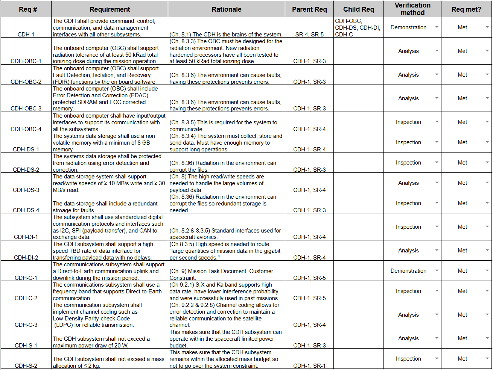

Developed subsystem requirements derived from mission-level requirements covering:

- Onboard computing
- Radiation tolerance
- Data storage
- Communications
- Fault detection and recovery
- Power allocation
- Mass allocation

## Verification Planning

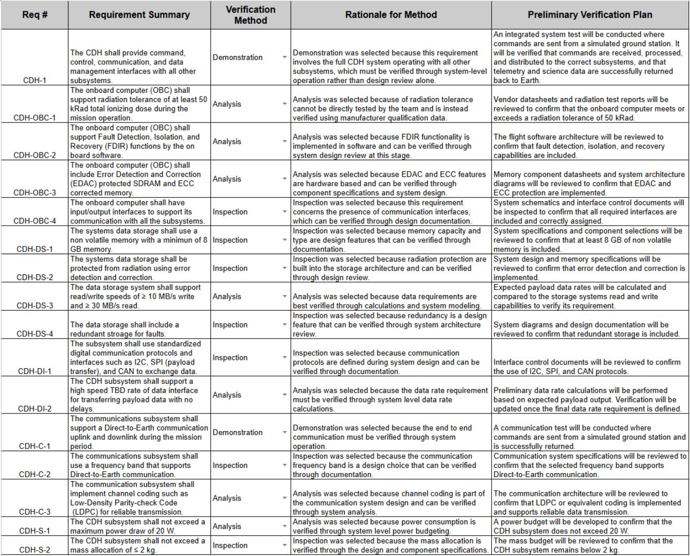

Developed preliminary verification plans using NASA verification methods:

- Inspection
- Analysis
- Demonstration

Each subsystem requirement was mapped to an appropriate verification method to support future integration and testing.

## Onboard Computer Trade Study

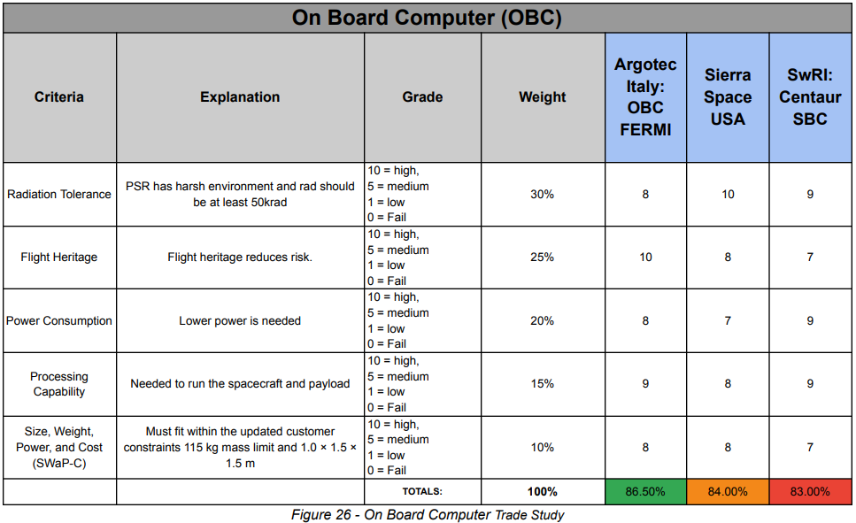

Compared multiple radiation-tolerant onboard computers using weighted engineering criteria:

- Radiation tolerance
- Flight heritage
- Processing capability
- Power consumption
- SWaP-C

The Argotec FERMI onboard computer achieved the highest overall score while satisfying mission requirements.

## Data Storage Trade Study

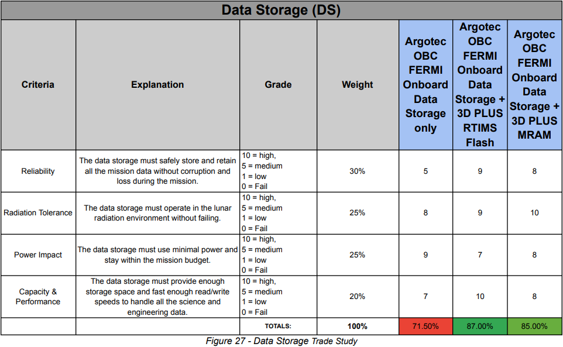

Evaluated multiple storage architectures based on:

- Reliability
- Radiation tolerance
- Storage capacity
- Read/write performance
- Power consumption

The selected architecture balanced redundancy, radiation tolerance, and storage performance while remaining within spacecraft resource constraints.

## Data Interface Trade Study

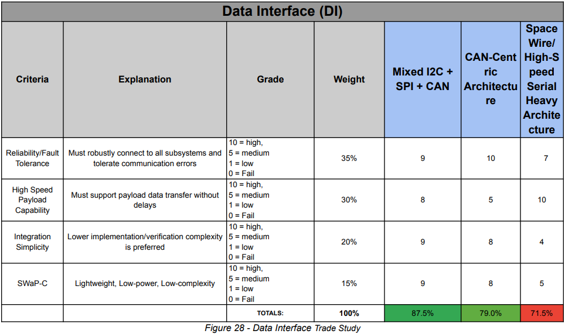

Compared multiple spacecraft communication architectures to optimize:

- Reliability
- Payload throughput
- Integration complexity
- SWaP-C

The selected architecture provided reliable subsystem communications while supporting high-speed payload data transfer.

## Communications Trade Study

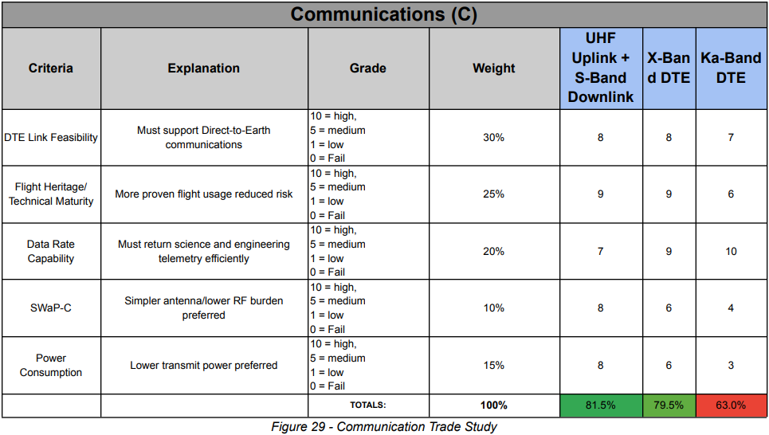

Evaluated multiple Direct-to-Earth communication architectures using weighted criteria including:

- Mission feasibility
- Flight heritage
- Data rate capability
- Power consumption
- SWaP-C

The selected architecture provided the best balance between communication performance and spacecraft resource utilization.
## CDH Subsystem Mass & Power Budget

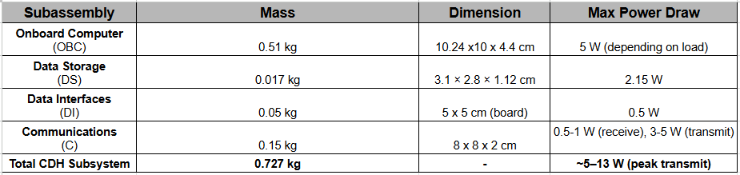

Developed subsystem mass and power budgets to verify compliance with spacecraft-level SWaP constraints.

Final CDH subsystem budget:

- Mass: **0.727 kg**
- Peak power: **~13 W**

Both values remained within the allocated spacecraft limits of **2 kg** and **20 W**.

---
# NASA Systems Engineering Reviews

Project POLARIS progressed through NASA's systems engineering lifecycle, culminating in four formal design reviews. As a member of the engineering and program management teams, I co-authored each deliverable while contributing to the Command & Data Handling subsystem and programmatic planning.

| Review | My Primary Contributions |
|---------|--------------------------|
| Mission Concept Review (MCR) | Mission planning, early CDH architecture, and technical documentation |
| Systems Requirements Review (SRR) | CDH requirements, hardware trade studies, subsystem interfaces |
| Mission Definition Review (MDR) | Schedule BoE, Cost BoE, procurement planning, and mission documentation |
| Preliminary Design Review (PDR) | CDH architecture, verification planning, subsystem integration, and final design documentation |

Throughout these reviews our team developed:

- Science Traceability Matrix (STM)
- Mission Requirements
- Subsystem Requirements
- Trade Studies
- Risk Analysis
- Failure Mode & Effects Analysis (FMEA)
- Verification Plans
- Procurement Plans
- Cost Estimates
- Mission Schedule
- Interface Control Documentation

# Project Management Contributions

As Deputy Program Manager of Resources, I worked on several programmatic aspects of the mission in addition to my technical responsibilities.

Major contributions included:

- Schedule Basis of Estimate (BoE)
- Cost Basis of Estimate (BoE)
- Integrated mission schedule
- Resource planning
- Procurement planning
- Cost analysis
- Mission planning
- Schedule development
- Review preparation
- Design review coordination

---

# Mission Schedule

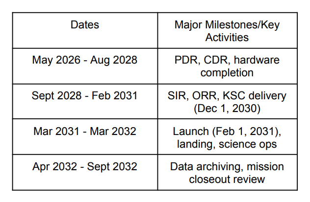

The mission schedule followed NASA's mission lifecycle from preliminary design through launch, surface operations, and mission closeout.

Major milestones included:

- Preliminary Design Review (PDR)
- Critical Design Review (CDR)
- Hardware integration
- System Integration Review (SIR)
- Operational Readiness Review (ORR)
- Launch
- Lunar landing
- Science operations
- Mission closeout

---

# Organization

## Mission Organization
Project POLARIS was developed by an interdisciplinary engineering team consisting of:

- Systems Engineering
- Project Management
- Mechanical Engineering
- Electrical Engineering
- Thermal Engineering
- Payload Engineering
- Science Division
- Program Analysis
- Mission Assurance

Working in this environment provided experience collaborating across multiple engineering disciplines while following NASA systems engineering practices.

---

# Technical Skills Demonstrated

## Systems Engineering

- Requirements Engineering
- Verification & Validation
- Engineering Trade Studies
- Interface Control
- Risk Analysis
- Failure Mode & Effects Analysis (FMEA)

## Spacecraft Systems

- Command & Data Handling (CDH)
- Fault Detection, Isolation & Recovery (FDIR)
- Telemetry Processing
- Spacecraft Communications
- Data Storage Architecture
- Spacecraft Interfaces
- SWaP Budgeting

## Program Management

- Cost Estimation
- Schedule Development
- Schedule Basis of Estimate (BoE)
- Cost Basis of Estimate (BoE)
- Procurement Planning
- Resource Planning

---

# Tools & Technologies

- Systems Engineering
- NASA L'SPACE
- Microsoft Visio
- Draw.io
- Lucidchart
- Microsoft Project
- Excel
- PowerPoint

---

# Key Takeaways

Project POLARIS provided hands-on experience applying NASA systems engineering practices to the conceptual design of a lunar exploration mission.

Through this project I gained experience in:

- Requirements development
- Spacecraft subsystem design
- Engineering trade studies
- Verification planning
- Technical documentation
- Cross-disciplinary engineering collaboration
- Cost and schedule development
- NASA design review processes

Serving simultaneously as a Command & Data Handling Engineer and Deputy Program Manager of Resources strengthened both my technical engineering and project management skills while working within a multidisciplinary engineering team.

---

# Certificate

NASA L'SPACE Mission Concept Academy Certificate of Completion

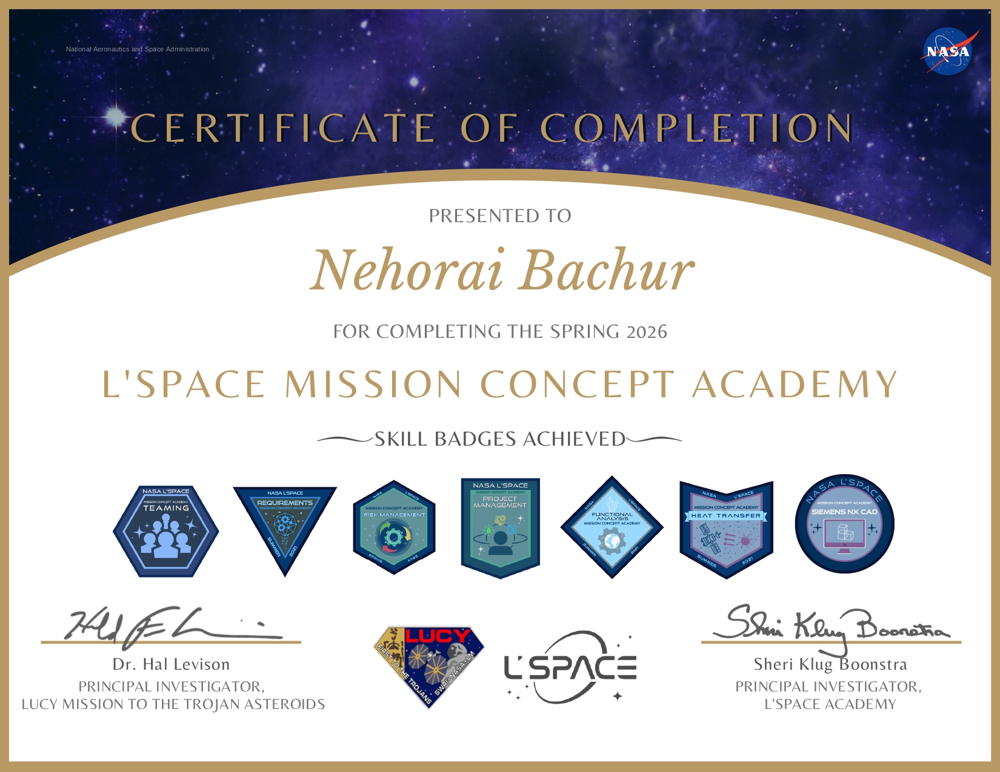

---

# Repository Contents

```
NASA-Polaris-Lunar-Rover
│
├── README.md
├── images/
│   ├── 01-mission-overview.png
│   ├── 02-mission-location.png
│   ├── 03-concept-of-operations.png
│   ├── 04-cdh-software-architecture.png
│   ├── 05-mission-schedule.png
│   ├── organization-chart.png
│   └── 06-certificate.pdf
```

---

# About NASA L'SPACE

NASA's L'SPACE Mission Concept Academy is a workforce development program that introduces students to NASA's systems engineering process by guiding multidisciplinary teams through the complete formulation of a conceptual space mission. Participants develop mission concepts using industry-standard engineering practices while progressing through formal NASA design reviews including Mission Concept Review (MCR), Systems Requirements Review (SRR), Mission Definition Review (MDR), and Preliminary Design Review (PDR).

---

## Connect With Me

Thank you for taking the time to review Project POLARIS.

If you have questions about this project or would like to discuss engineering opportunities, please feel free to reach out.

- LinkedIn: [https://www.linkedin.com/in/nehoraibachur/](https://www.linkedin.com/in/nehoraibachur/)
- GitHub: [https://github.com/nehoraibar](https://github.com/nehoraibar)
- Email: nehoraibar@gmail.com
